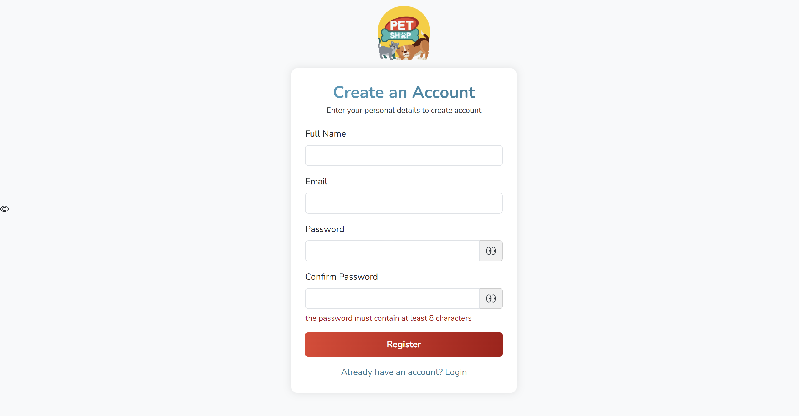

# PetSmart: PLATFORM PET SHOP BERBASIS WEB DAN MOBILE DENGAN FITUR AI

## Deskripsi Proyek

**PetSmart** adalah platform pet shop berbasis **web dan mobile** yang dirancang untuk memudahkan pemilik hewan peliharaan dalam mengakses produk, layanan, dan solusi cepat terhadap permasalahan kesehatan hewan melalui fitur **Kecerdasan Buatan (AI)** sederhana.

Platform ini dikembangkan menggunakan metode **Agile** dan dilengkapi dengan antarmuka yang intuitif dan responsif, backend yang solid, serta sistem database yang mengelola data produk, pengguna, transaksi, dan hasil diagnosis.

---

## Fitur Utama

### Untuk Admin:
1. Melihat statistik jumlah pengguna, transaksi, dan layanan.
2. Mengetahui **produk top selling**.
3. Mengelola data:
  - Akun pengguna
  - Produk
  - Transaksi
  - Layanan
  - Konsultasi

### Untuk Pengguna:
1. Membeli produk secara langsung, dimasukkan ke keranjang, dan mencetak struk belanja.
2. Mengakses layanan/service hewan.
3. Melakukan konsultasi seputar hewan peliharaan.
4. Menggunakan fitur **AI Diagnosis** dengan pertanyaan interaktif untuk mengetahui gejala kesehatan hewan.

---

## Teknologi yang Digunakan

- **Laravel** (backend dan frontend web)
- **MySQL** (database)
- **HTML, CSS, JS** (frontend)
- **AI Sederhana** (rule-based diagnosis dan penyortiran produk)

---

## Tampilan Antarmuka

### Halaman Admin
Melihat statistik dan mengelola semua data platform.


---

### Halaman Login & Register




---

### Halaman Home


---

### Halaman Layanan


---

### Halaman Konsultasi / Chat


---

### Halaman Diagnosis AI


---

### Halaman Shop & Keranjang


---

## Potensi Pengembangan Selanjutnya

Beberapa fitur di platform ini dapat disempurnakan untuk meningkatkan kenyamanan dan pengalaman pengguna, seperti:

1. **Integrasi Pembayaran Digital**: Menambahkan metode pembayaran modern seperti **QRIS, e-wallet (OVO, DANA, ShopeePay), dan virtual account** untuk memudahkan transaksi.
2. **Live Chat & Notifikasi Real-time**: Integrasi WebSocket atau Firebase agar konsultasi terasa lebih langsung dan responsif.
3. **Sistem Antrian Layanan**: Untuk layanan offline seperti grooming atau klinik, pengguna dapat mengambil nomor antrian digital.
4. **Rekomendasi Produk Otomatis**: Memanfaatkan **machine learning** untuk memberikan saran produk berdasarkan histori transaksi atau diagnosis hewan.
5. **Mobile App (Flutter/React Native)**: Pengembangan versi mobile native agar lebih nyaman digunakan di smartphone.

---

## Cara Menjalankan Proyek

### Langkah-langkah Setup

```bash
#1.Install dependency PHP
composer install

# 2. Salin file .env
cp .env.example .env

# 3. Generate key
php artisan key:generate

# 4. Jalankan migrasi database
php artisan migrate

# 5. Jalankan server lokal
php artisan serve

